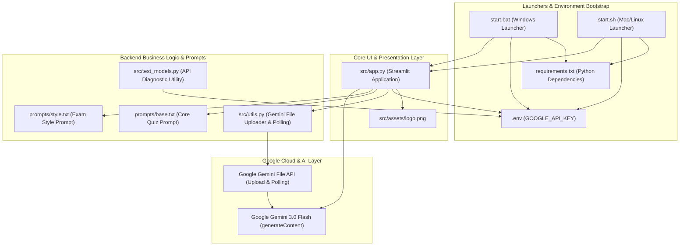
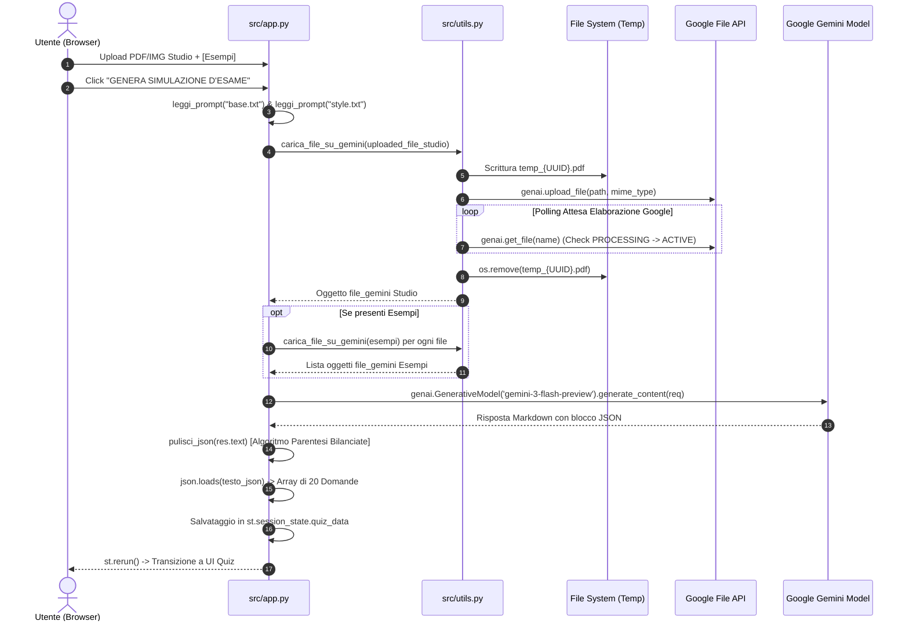
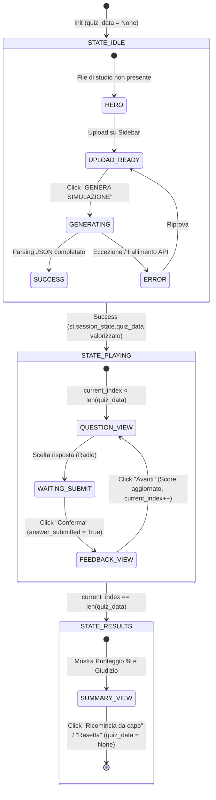

# 🤖 AGENTS.MD — KNOWLEDGE BASE & ARCHITECTURAL GRAPH FOR AI AGENTS

> **Scopo di questo documento**: Questo file costituisce la documentazione architetturale, il grafo di dipendenza, la mappa dello stato e l'analisi tecnica esaustiva dell'intero ecosistema **`legacy/`** del progetto `pdf-quiz-gen` (**University Quiz Generator AI**).
> Tutti gli AI Agent che interverranno successivamente per refactoring, analisi di sicurezza, migrazioni di modello o estensioni funzionali **devono** fare riferimento alle specifiche, ai contratti di dati, ai diagrammi e alle note di debito tecnico qui formalizzati.

---

## 1. 🌐 Executive Summary & Overview dell'Architettura

Il progetto **University Quiz Generator AI (`pdf-quiz-gen`)** è un'applicazione web basata su **Streamlit** e sull'API multimodale di **Google Gemini** per generare simulazioni d'esame universitarie (quiz a risposta multipla) partendo da documenti PDF o immagini (appunti, libri, slide) e, facoltativamente, imitando lo stile di prove d'esame precedenti.

### Parametri e Stack Tecnologico
- **Linguaggio**: Python 3.12+
- **UI Framework**: Streamlit `1.52.2`
- **AI Engine**: Google Gemini API (`google-generativeai==0.8.6`)
- **Modello Default nel Codice**: `gemini-3-flash-preview`
- **Librerie di Supporto Chiave**: `pypdf==6.6.0`, `pillow==12.1.0`, `pandas==2.3.3`, `python-dotenv==1.2.1`
- **Lancio & Automazione**: Launcher multipiattaforma (`start.bat` per Windows, `start.sh` per Mac/Linux) con gestione automatica di ambiente virtuale (`venv`) e `.env`.

---

## 2. 📊 Diagrammi Architetturali (Mermaid Graphs)

### 2.1. Grafo del Sistema & Dipendenze tra Componenti
Il seguente grafo illustra la relazione gerarchica tra i launcher, le librerie, le risorse e gli endpoint cloud di Google Gemini:



---

### 2.2. Grafo della Pipeline Multimodale di Generazione Quiz
Questo schema dettaglia il flusso dei dati durante la generazione di un'esame (dall'upload utente in RAM alla serializzazione nello stato di Streamlit):



---

### 2.3. Grafo della Macchina a Stati (UI State Machine)
Streamlit gestisce il ciclo di vita dell'applicazione tramite `st.session_state`. La logica condizionale in [app.py](file:///C:/Users/DeaDS/Documents/Programming%20projects/pdf-quiz-gen/legacy/src/app.py) implementa un automa a tre stati principali:



---

## 3. 📁 Analisi File-by-File Completa (`legacy/`)

Di seguito l'elenco e l'analisi tecnica approfondita di ogni singolo file presente nella cartella `legacy/`, completa di firme di funzioni, ruoli architetturali e note operative.

| File | Tipo | Ruolo Architetturale | Componenti / Elementi Chiave |
| :--- | :--- | :--- | :--- |
| [legacy/leggimi.txt](file:///C:/Users/DeaDS/Documents/Programming%20projects/pdf-quiz-gen/legacy/leggimi.txt) | Documentazione | Guida d'avvio rapido utente | Istruzioni per Windows, macOS, Linux e ottenimento chiave Google AI Studio |
| [legacy/Python](file:///C:/Users/DeaDS/Documents/Programming%20projects/pdf-quiz-gen/legacy/Python) | Log / Artefatto | Residuo di esecuzione terminale | File di 2 righe (`   - trovato.`) generato involontariamente da redirection in script |
| [legacy/requirements.txt](file:///C:/Users/DeaDS/Documents/Programming%20projects/pdf-quiz-gen/legacy/requirements.txt) | Configurazione | Dipendenze del progetto | 50+ pacchetti Python pin-pointati. **Nota tecnica**: File salvato con encoding `UTF-16LE` |
| [legacy/start.bat](file:///C:/Users/DeaDS/Documents/Programming%20projects/pdf-quiz-gen/legacy/start.bat) | Script Batch | Bootstrap per Windows | Controllo Python (`python`/`py`/`python3`), venv, installazione `pip`, input interattivo `.env` |
| [legacy/start.sh](file:///C:/Users/DeaDS/Documents/Programming%20projects/pdf-quiz-gen/legacy/start.sh) | Shell Script | Bootstrap per Mac/Linux | Equivalente POSIX di `start.bat`, con comandi bash (`command -v`, `source venv/bin/activate`) |
| [legacy/prompts/README.md](file:///C:/Users/DeaDS/Documents/Programming%20projects/pdf-quiz-gen/legacy/prompts/README.md) | Documentazione | Documentazione generale app | Panoramica funzionalità, guide multimodali e zero-config (erroneamente collocato in `prompts/`) |
| [legacy/prompts/base.txt](file:///C:/Users/DeaDS/Documents/Programming%20projects/pdf-quiz-gen/legacy/prompts/base.txt) | Prompt | Core System Prompt di Gemini | Richiede un quiz a 20 domande (A-D) distribuito tra tutto il documento, con distrattori plausibili |
| [legacy/prompts/style.txt](file:///C:/Users/DeaDS/Documents/Programming%20projects/pdf-quiz-gen/legacy/prompts/style.txt) | Prompt | Few-shot / Style Imitation | Istruisce l'AI a copiare tono di voce, complessità lessicale, distrattori e stile delle spiegazioni |
| [legacy/src/app.py](file:///C:/Users/DeaDS/Documents/Programming%20projects/pdf-quiz-gen/legacy/src/app.py) | Python Core | Main Streamlit App & Controller | UI, State Machine, iniezione CSS, formattazione prompt multimodale e logica interattiva quiz |
| [legacy/src/utils.py](file:///C:/Users/DeaDS/Documents/Programming%20projects/pdf-quiz-gen/legacy/src/utils.py) | Python Module | Helper Upload Google File API | Gestione file temporanei `UUID`, upload su Gemini, polling stato `PROCESSING` e cleanup file |
| [legacy/src/test_models.py](file:///C:/Users/DeaDS/Documents/Programming%20projects/pdf-quiz-gen/legacy/src/test_models.py) | Python Script | Utilità di diagnosi API | Controlla chiave API dal `.env` e stampa elenco modelli che supportano `generateContent` |
| [legacy/src/assets/logo.png](file:///C:/Users/DeaDS/Documents/Programming%20projects/pdf-quiz-gen/legacy/src/assets/logo.png) | Asset Binario | Logo dell'applicazione | Immagine PNG utilizzata per l'header della pagina Streamlit e per il logo della sidebar |

---

### 3.1. Dettaglio Specifico per Modulo Python

#### 🔹 `legacy/src/app.py`
È l'entry-point dell'applicazione ed esegue l'intera logica client/server in un unico script reattivo Streamlit (301 righe):
- **Stile CSS (L18-51)**: Configura sfondo scuro `#0e1117`, pulsanti sfumati lineare (`#FF4B4B` -> `#FF914D`), valori metrici `2rem` e barra di progresso con gradiente cromatico.
- **Funzioni Interne**:
  - `leggi_prompt(nome_file: str) -> str`: Rileva la directory base (`base_dir`) ed esegue l'apertura UTF-8 in [prompts/](file:///C:/Users/DeaDS/Documents/Programming%20projects/pdf-quiz-gen/legacy/prompts). Restituisce stringa vuota se assente.
  - `pulisci_json(testo_response: str) -> str`: Rimuove i markdown fences (`` ```json ``). Applica un **algoritmo di conteggio parentesi** (`count` su `[` e `]`) dal primo carattere `[` per estrarre la substring JSON esatta, prevenendo crash in caso di testo prolisso aggiunto dal LLM in coda al JSON.
- **Gestione Streamlit Session State (L95-99)**:
  - `quiz_data`: `list[dict] | None` (Memorizza le domande parse dal JSON).
  - `current_index`: `int` (Indice della domanda attuale, 0-indexed).
  - `score`: `int` (Conteggio risposte corrette).
  - `answer_submitted`: `bool` (Fase di visualizzazione feedback prima del passaggio alla domanda successiva).
- **Integrazione Generative AI (L170-218)**:
  - Invocazione del modello tramite `genai.GenerativeModel('gemini-3-flash-preview')`.
  - Aggiunge in coda alla richiesta un vincolo strutturale rigido per forzare un array JSON nel formato specificato dal contratto dati (sezione 4).

#### 🔹 `legacy/src/utils.py`
Modulo dedicato all'interfacciamento con la **Google Gemini File API** (56 righe):
- `carica_file_su_gemini(uploaded_file: st.runtime.uploaded_file_manager.UploadedFile) -> genai.types.File`:
  1. **Isolamento temporaneo**: Genera `f"temp_{uuid.uuid4()}.pdf"` su disco dal buffer in RAM, garantendo compatibilità con ambienti multi-utente e prevenendo blocchi del file system Windows.
  2. **MIME Detection**: Mappa `uploaded_file.type` o ricorre a `application/pdf` come fallback.
  3. **Chiamata API**: Esegue `genai.upload_file(path=nome_file_temporaneo, mime_type=mime_type)`.
  4. **Active Polling**: Esegue un ciclo `while file_gemini.state.name == "PROCESSING": time.sleep(1)` e `genai.get_file(name)` fino al passaggio ad `ACTIVE`.
  5. **Gestione Errori e Finally**: Solleva `ValueError` in caso di stato `FAILED`. Il blocco `finally:` attende `0.5s` (per rilascio handle di Windows) prima di invocare `os.remove()`, ignorando silenziosamente eccezioni di lock.

#### 🔹 `legacy/src/test_models.py`
Script autonomo per debug e verifica credenziali (22 righe):
- Carica `.env` via `load_dotenv()`, configura il client `genai.configure(api_key=api_key)` e itera su `genai.list_models()`, stampando a terminale unicamente i modelli che presentano `'generateContent'` in `supported_generation_methods`.

---

## 4. 📋 Contratti Dati (Data Schemas & Session State Dictionary)

### 4.1. Contratto JSON di Output di Google Gemini
Per garantire stabilità al parser `json.loads()`, il LLM deve emettere esclusivamente un array di oggetti con la seguente struttura rigorosa:

```json
[
  {
    "domanda": "Qual è la differenza principale tra la Memoria Virtuale e la Memoria Fisica?",
    "opzioni": [
      "La memoria virtuale è un'astrazione gestita dall'OS, mentre la fisica è l'hardware RAM",
      "La memoria fisica ha capacità infinita rispetto a quella virtuale",
      "La memoria virtuale è accessibile solo dal BIOS del sistema",
      "Non esiste alcuna differenza strutturale nei moderni architetture 64-bit"
    ],
    "corretta": 0,
    "spiegazione": "La risposta corretta è la A poiché la Memoria Virtuale consente all'OS di mappare indirizzi logici su memoria fisica di supporto (RAM e swap), come indicato al Capitolo 3."
  }
]
```

> [!IMPORTANT]
> - `corretta` **deve** essere un intero tra `0` e `3` corrispondente all'indice zero-based dell'array `opzioni`.
> - L'array finale **deve** contenere 20 oggetti completi (da specifica di [base.txt](file:///C:/Users/DeaDS/Documents/Programming%20projects/pdf-quiz-gen/legacy/prompts/base.txt)).

### 4.2. Session State Dictionary
Tabella delle chiavi nel contesto operativo di Streamlit:

| Chiave | Tipo Python | Valore Iniziale | Descrizione e Regola di Mutazione |
| :--- | :--- | :--- | :--- |
| `quiz_data` | `list[dict] \| None` | `None` | Contiene l'intero esame. Viene settato alla fine di `json.loads()` e riportato a `None` durante il reset. |
| `current_index` | `int` | `0` | Indice della domanda visualizzata (da `0` a `len(quiz_data)`). Viene incrementato alla pressione del bottone "Avanti". |
| `score` | `int` | `0` | Numero totale di risposte esatte confermate dall'utente nell'esame corrente. |
| `answer_submitted` | `bool` | `False` | Flag che blocca i radio button e fa apparire il blocco `st.success` / `st.error` al posto del bottone "Conferma". |

---

## 5. 🛠️ Debito Tecnico, Note Operative & Guideline per AI Agents

Gli agenti che dovranno intervenire sul codice di questa cartella (`legacy/`) per indagini, migrazioni o modifiche **devono** tenere conto delle seguenti criticità ed evincere queste invarianti di progetto:

1. **Nome del Modello Gemini (`gemini-3-flash-preview`)**:
   - In [app.py:L205](file:///C:/Users/DeaDS/Documents/Programming%20projects/pdf-quiz-gen/legacy/src/app.py#L205), viene usato il nome di modello `'gemini-3-flash-preview'`. Durante future refactoring o aggiornamenti delle API Google AI Studio, l'agente deve verificare che il modello non sia stato deprecato e sostituirlo con l'identificativo di produzione raccomandato.
2. **Encoding di `requirements.txt` (`UTF-16LE`)**:
   - Il file [legacy/requirements.txt](file:///C:/Users/DeaDS/Documents/Programming%20projects/pdf-quiz-gen/legacy/requirements.txt) è salvato con encoding `UTF-16LE` (probabile output di un comando PowerShell su Windows come `pip freeze > requirements.txt`). Gli script di analisi convenzionali o su sistemi POSIX possono fallire se tentano la lettura in ASCII/UTF-8. È consigliata la riconversione in `UTF-8` durante pulizie o refactoring.
3. **Resilienza dell'Algoritmo `pulisci_json`**:
   - L'algoritmo di parentesi bilanciate in [app.py:L67-93](file:///C:/Users/DeaDS/Documents/Programming%20projects/pdf-quiz-gen/legacy/src/app.py#L67-L93) è efficace per array JSON di livello superiore, ma potrebbe produrre un offset errato in caso l'LLM includa caratteri non intercettati di stringhe sfuggite in una spiegazione che contiene parentesi quadre litere non bilanciate (es. `"[Esempio [ non chiuso]"`). In futuri upgrade, valutare l'integrazione di `pydantic` o `response_schema` nativo nelle API di Google Gemini.
4. **Rimozione dei File Temporanei con Delay su Windows**:
   - In [utils.py:L49](file:///C:/Users/DeaDS/Documents/Programming%20projects/pdf-quiz-gen/legacy/src/utils.py#L49), l'attesa `time.sleep(0.5)` prima della cancellazione nel blocco `finally:` è vitale per prevenire eccezioni di lock su Windows (`PermissionError`). **Non eliminare questo delay** se si mantiene la scrittura dei temporanei su disco.
5. **Posizione Anomala di `README.md` in `prompts/`**:
   - Il file [legacy/prompts/README.md](file:///C:/Users/DeaDS/Documents/Programming%20projects/pdf-quiz-gen/legacy/prompts/README.md) corrisponde alla documentazione principale dell'applicazione ed è stato collocato nella sottocartella `prompts/`. Per il corretto mantenimento, in futuri refactoring va valutato lo spostamento in radice della directory `legacy/` o del progetto.
6. **File Spazzatura (`legacy/Python`)**:
   - Il file [legacy/Python](file:///C:/Users/DeaDS/Documents/Programming%20projects/pdf-quiz-gen/legacy/Python) di 2 righe è un artefatto inutile e può essere rimosso in sicurezza durante azioni di cleanup, in quanto non referenziato dai launcher né dall'app.

---
*Documento generato per il supporto all'analisi e al refactoring di agenti AI. Tutti i link alle risorse puntano alla cartella `legacy/`.*
