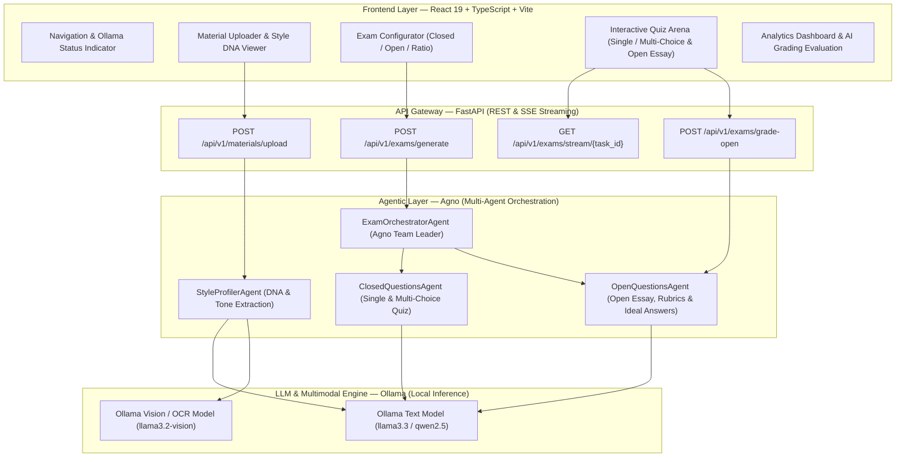
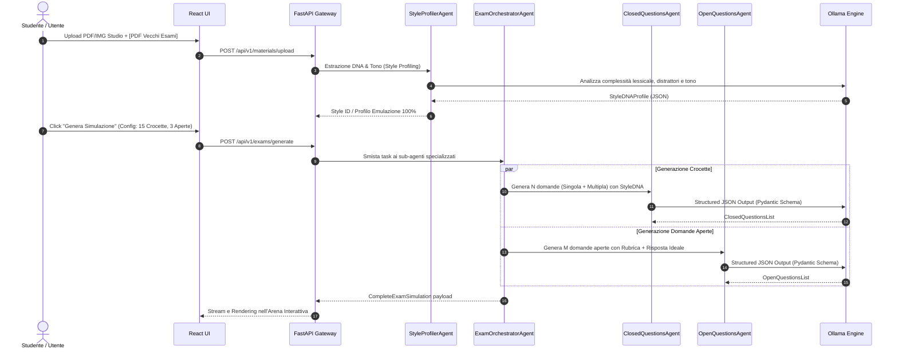
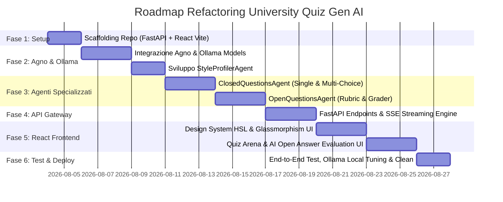

# 🚀 PLAN.MD — ARCHITECTURAL BLUEPRINT & EXECUTABLE ROADMAP: NEXT-GEN UNIVERSITY QUIZ AI

> **Visione Architetturale**: Refactoring completo e rimpiazzo dell'architettura legacy (Streamlit + script monolitico + Gemini Flash SDK) verso una piattaforma **Web App Full-Stack** basata su **React + TypeScript + Vite** nel Frontend, **FastAPI + Agno (`agno`)** nel Backend, e motori LLM locali via **Ollama** (es. `llama3.3`, `qwen2.5`, `mistral`, `llama3.2-vision`).
> Il sistema impiega **due Agenti Specializzati** coordinati da un Orchestratore e un Modulo di Profilazione per garantire una **fedeltà di emulazione del 100%** (stile, difficoltà, lessico, tono del docente, trabocchetti nei distrattori e profondità delle spiegazioni) rispetto ai documenti di studio ed esempi forniti.

---

## 1. 🏗️ High-Level Architecture & Stack Tecnologico



### 🔹 Core Technology Stack
- **Frontend**: React 19, TypeScript, Vite, Vanilla CSS + Design System Custom Tokens (Palette HSL dark mode, Glassmorphism, Micro-animazioni WOW).
- **Backend**: Python 3.12+, FastAPI, Uvicorn, Pydantic v2 (Validazione e contratti dati stretti), Server-Sent Events (SSE) per streaming interattivo.
- **Agent Orchestrator**: **Agno** (`agno` / `agno.agent.Agent`, `agno.models.ollama.Ollama`).
- **LLM Engine**: **Ollama** (Esecuzione locale ad alta privacy e zero costi, compatibile con `llama3.3:latest`, `qwen2.5:14b`, `llama3.2-vision` per analisi visuale di diagrammi/PDF scansionati).

---

## 2. 🤖 Architettura Multi-Agente in Agno & 100% Style Emulation

Per raggiungere l'obiettivo di **emulazione al 100%** del tono, forma, difficoltà e stile degli esami universitari, il sistema non genera domande con un prompt generico, ma adotta una pipeline a tre passaggi coordinata da Agno.



### 2.1. Modulo 0: `StyleProfilerAgent` (The Exam DNA Extractor)
- **Scopo**: Leggere i documenti di esempio del docente (o in assenza, analizzare lo stile del libro/appunti di studio) e compilare un profilo Pydantic di istruzioni comportamentali rigorose (`StyleDNAProfile`).
- **Parametri estratti per l'emulazione 100%**:
  1. *Livello di formalità e lessico tecnico* (es. latino giuridico, formalismo matematico-ingegneristico, o definizioni discorsive).
  2. *Design dei Distrattori* (opzioni palesemente assurde vs distrattori insidiosi che differiscono per un solo parametro o negazione).
  3. *Forma delle Opzioni* (risposte brevi di una parola vs paragrafi descrittivi strutturati).
  4. *Profondità della Spiegazione/Risposta Ideale* (richiesta di riferimenti ai capitoli/teoremi o sintesi discorsiva).

### 2.2. Agente 1: `ClosedQuestionsAgent` (Quiz a Scelta Singola e Multipla)
- **Framework**: `agno.agent.Agent(model=Ollama(id="llama3.3"), response_model=ClosedExamSection)`
- **Competenza**:
  - **Scelta Singola (`single_choice`)**: Esattamente 1 risposta corretta fra 4 opzioni, con distrattori calibrati sullo stile del prof.
  - **Scelta Multipla (`multiple_choice`)**: Da 2 a 3 risposte corrette su 4 o 5 opzioni (quiz stile concorso/esami di ingegneria o medicina con caselle di controllo a checkbox), dove l'utente deve selezionare tutte le opzioni esatte.
- **Garanzia Strutturale**: Ritorna **esclusivamente** JSON validato via Pydantic, privo di allucinazioni di sintassi.

### 2.3. Agente 2: `OpenQuestionsAgent` (Domande Aperte, Rubrica e Valutatore)
- **Framework**: `agno.agent.Agent(model=Ollama(id="llama3.3"), response_model=OpenExamSection)`
- **Competenza**:
  - **Creazione Tracce**: Domande teoriche di sviluppo, dimostrazioni, confronti critici o case study pratici.
  - **Modello di Risposta 100% Emulato (`ideal_answer`)**: Stesura di una risposta esplicativa completa con la medesima profondità scientifica e terminologica del docente.
  - **Rubrica di Valutazione (`grading_rubric`)**: Lista strutturata dei concetti chiave obbligatori (es. *"+3 punti se cita il teorema di Bayes"*, *"-2 punti se confonde la varianza con la deviazione standard"*).
  - **Funzionalità Valutatore (`GradeAnswer`)**: Quando l'utente invia la propria risposta nell'interfaccia, questo agente confronta la risposta utente con l'ideal answer e la rubrica, assegnando un punteggio analitico (es. 24/30 o 8/10) con feedback puntuale sul cosa manca.

---

## 3. 📋 Contratti Dati & Schemi Pydantic v2

Tutti gli scambi di dati tra Agno, FastAPI e il frontend React rispettano questi contratti dati formali:

```python
from pydantic import BaseModel, Field
from typing import List, Literal, Optional

# --- 1. STYLE DNA PROFILE ---
class StyleDNAProfile(BaseModel):
    tone_formality: str = Field(description="Livello di formalità accademica ed esempi lessicali da adottare.")
    distractor_subtlety: str = Field(description="Come strutturare le risposte errate per replicare l'esame vero.")
    question_length_words: int = Field(description="Lunghezza media stimata del testo delle domande.")
    citation_requirement: bool = Field(description="Se le spiegazioni devono menzionare il capitolo/formula di riferimento.")

# --- 2. CLOSED QUESTIONS (AGENT 1) ---
class ClosedQuestionItem(BaseModel):
    id: str
    question_type: Literal["single_choice", "multiple_choice"]
    question_text: str
    options: List[str] = Field(min_length=4, max_length=5)
    correct_indices: List[int] = Field(description="Array di indici (0-based). 1 elemento per single_choice, >=2 per multiple_choice.")
    explanation: str = Field(description="Spiegazione accademica completa in stile 100% docente.")
    topic_tag: str = Field(description="Argomento del sillabo universario coperto.")

# --- 3. OPEN QUESTIONS (AGENT 2) ---
class GradingCriterion(BaseModel):
    concept: str
    max_points: float
    required_keywords: List[str]

class OpenQuestionItem(BaseModel):
    id: str
    question_text: str
    scenario_context: Optional[str] = None
    ideal_answer: str = Field(description="Risposta perfetta completa e dettagliata del professore.")
    grading_rubric: List[GradingCriterion]
    max_total_points: float = 30.0
    topic_tag: str

# --- 4. COMPREHENSIVE EXAM PAYLOAD ---
class CompleteExamSimulation(BaseModel):
    exam_title: str
    style_dna: StyleDNAProfile
    closed_questions: List[ClosedQuestionItem]
    open_questions: List[OpenQuestionItem]
```

---

## 4. 🎨 Design & UI/UX Experience (React 19 + Vite)

La nuova interfaccia elimina i limiti dei componenti di default di Streamlit e implementa una UI da applicazione web premium:
- **Palette Colori HSL (Cyber Academic Dark Mode)**:
  - Background principale: `hsl(220, 26%, 8%)` (`#0B0E14`)
  - Pannelli & Card Glassmorphism: `rgba(255, 255, 255, 0.04)` con bordo `1px solid rgba(255, 255, 255, 0.08)` e blur `12px`
  - Colore Primario (Call-to-Action & Progress): Gradiente da `hsl(190, 90%, 50%)` (Neon Cyan) a `hsl(150, 85%, 55%)` (Mint)
  - Colore Secondario (Highlight & Emulation Tag): Gradiente da `hsl(15, 90%, 55%)` (Coral) a `hsl(45, 95%, 55%)` (Amber)
- **Micro-Animazioni (CSS Transitions & Framer Motion)**:
  - *Ripple e bagliore neon* alla selezione delle caselle di risposta.
  - *Transizione fluida (Slide-and-Fade)* dal form di configurazione all'Arena d'Esame.
  - *Grading Typewriter Effect*: Durante la correzione di una domanda aperta, il giudizio dell'AI e il punteggio compaiono progressivamente con una barra di avanzamento e un badge di voto (es. `30/30 ECELLENTE`).

### 🔹 Struttura Componenti React (`src/components/`)
```
src/
├── components/
│   ├── layout/
│   │   ├── Navbar.tsx             # Brand, stato connessione Ollama (🟢 Local OK) e Switch Dark Mode
│   │   └── AppLayout.tsx          # Grid reattivo CSS con Sidebar fissa e Arena centrale
│   ├── sidebar/
│   │   ├── MaterialUploader.tsx   # Dropzone PDF/IMG con indicatore di caricamento multiplo
│   │   └── StyleDNACard.tsx       # Preview visiva del "DNA Esame" estratto dall'Agente 0
│   ├── configurator/
│   │   ├── ExamConfigForm.tsx     # Slider per crocette singole/multiple, domande aperte e tempo
│   │   └── EmulationToggle.tsx    # Switch 100% Emulation Mode (Attiva/disattiva ricalco stile)
│   ├── arena/
│   │   ├── QuizHeader.tsx         # Timer esame, barra di avanzamento e selettore domanda rapido
│   │   ├── SingleChoiceCard.tsx   # Radio button personalizzati con animazione di conferma
│   │   ├── MultiChoiceCard.tsx    # Checkbox multi-selezionabili per risposte multiple
│   │   └── OpenQuestionCard.tsx   # Editor di testo espandibile con bottone "Valuta con AI"
│   └── results/
│       ├── ScoreDashboard.tsx     # Grafico radar per argomento e percentuale finale
│       └── RubricModal.tsx        # Visualizzatore di rubrica di correzione per le risposte aperte
```

---

## 5. 🗺️ Roadmap Operativa del Refactoring (6 Fasi)

Il refactoring sarà eseguito in modo graduale, modulare e verificabile passo dopo passo senza rompere l'esistente finché la nuova architettura non è 100% operativa:



### 🔹 Fase 1: Scaffolding e Ristrutturazione delle Directory
1. Creazione di una nuova directory `backend/` per l'ambiente FastAPI + Python 3.12.
2. Creazione di una nuova directory `frontend/` generata con `npx -y create-vite@latest ./ --template react-ts`.
3. Isolamento del codice preesistente (`src/`, `prompts/`, `start.*`) e marcatura in `legacy/` (già completata e documentata in [agents.md](file:///C:/Users/DeaDS/Documents/Programming%20projects/pdf-quiz-gen/agents.md)).

### 🔹 Fase 2: Configurazione Agno & Engine Ollama (Local LLM)
1. Installazione in `backend/requirements.txt` di `agno`, `fastapi`, `uvicorn`, `pydantic>=2.0`, `pypdf`, `pillow`.
2. Implementazione del modulo di connettività a Ollama (`backend/app/llm/ollama_client.py`), con verifica di disponibilità dei modelli (`llama3.3`, `qwen2.5`).
3. Creazione del modulo di ingestione multimodale (PDF parsing e OCR/visione per immagini di slide/appunti).
4. Implementazione di `StyleProfilerAgent` per analizzare il tono, la densità concettuale e le caratteristiche del professore.

### 🔹 Fase 3: Sviluppo e Unit Test dei Due Agenti Specializzati
1. **Sviluppo `ClosedQuestionsAgent`**:
   - Costruzione del prompt di emulazione 100% che inietta il `StyleDNAProfile`.
   - Generazione mista di quiz a **scelta singola** (`single_choice`) e a **scelta multipla / caselle di spunta** (`multiple_choice`).
   - Verifica di validazione Pydantic su schema `ClosedQuestionItem`.
2. **Sviluppo `OpenQuestionsAgent`**:
   - Costruzione del prompt per domande aperte discorsive o di calcolo/dimostrazione.
   - Generazione accoppiata di Traccia, Risposta Ideale del Professore e **Rubrica di Valutazione Analitica** (`GradingCriterion`).
   - Implementazione della funzione di valutazione della risposta dello studente (`grade_student_response()`).

### 🔹 Fase 4: Creazione API Gateway FastAPI & Real-Time Streaming
1. Configurazione del server FastAPI in `backend/app/main.py`.
2. Sviluppo endpoint REST `/api/v1/materials/upload` per gestione multi-file in memoria temporanea con UUID.
3. Sviluppo endpoint `/api/v1/exams/generate` con orchestrazione asincrona (`asyncio.gather` tra Agente 1 e Agente 2 per massima velocità di generazione locale).
4. Implementazione endpoint di correzione live delle domande aperte `/api/v1/exams/grade-open`.

### 🔹 Fase 5: Sviluppo Interfaccia Utente React (Vite + TS)
1. Creazione del Design System in `frontend/src/index.css` con palette scura HSL, ombre neon, glassmorphism e micro-animazioni.
2. Sviluppo della **MaterialSidebar** per upload file e visualizzazione del "DNA Esame".
3. Sviluppo del **ExamConfigurator** con controllo totale sui rapporti numerici (es. 10 singole, 5 multiple, 3 aperte).
4. Sviluppo dell'**Interactive Quiz Arena**, con switch istantaneo tra schede di domande chiuse (radio/checkbox) e schede di domande aperte con box di auto-valutazione AI.

### 🔹 Fase 6: Testing End-to-End, Ottimizzazione e Rilascio
1. Test di integrazione su modelli Ollama locali, verificando i tempi di risposta su CPU/GPU (con opzione di fallback sui modelli Flash/Lite per hardware limitato).
2. Verifica della fedeltà di emulazione 100% confrontando esami reali con le simulazioni prodotte dai due agenti.
3. Aggiornamento degli script di avvio (`start.bat` e `start.sh`) per avviare con un solo comando sia il backend FastAPI sia il dev server/build React.

---
*Piano architettonico redatto e pronto per l'esecuzione. Ogni fase potrà essere attivata sequenzialmente mantenendo la piena stabilità del progetto.*
