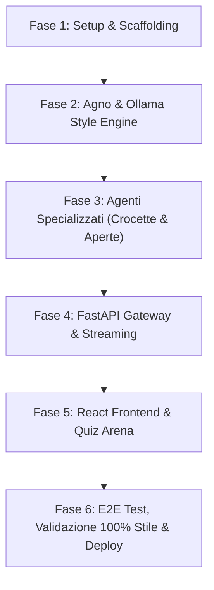

# 📋 MASTER TASK BOARD — NEXT-GEN UNIVERSITY QUIZ AI REFACTORING

> **Scopo**: Questa directory `tasks/` raccoglie la scomposizione operativa e granulare di ogni fase definita nel master-plan **[plan.md](file:///C:/Users/DeaDS/Documents/Programming%20projects/pdf-quiz-gen/plan.md)** per la migrazione dell'applicazione a **React 19 + TypeScript + Vite**, **FastAPI + Agno (`agno`)** e **Ollama** (modelli LLM/Visione locali), garantendo un'**emulazione del 100%** dello stile universitario sia nelle domande chiuse (singole/multiple) sia nelle domande aperte (con rubrica e AI grading).

---

## 🗂️ Indice delle Fasi e Progress Tracker

| Fase | File Task di Dettaglio | Obiettivo Principale | Stato |
| :--- | :--- | :--- | :--- |
| **Fase 1** | [tasks/phase1-setup.md](file:///C:/Users/DeaDS/Documents/Programming%20projects/pdf-quiz-gen/tasks/phase1-setup.md) | Scaffolding Repository, Backend FastAPI, Frontend React Vite e segregazione `legacy/` | 🟡 In Attesa |
| **Fase 2** | [tasks/phase2-agno-ollama.md](file:///C:/Users/DeaDS/Documents/Programming%20projects/pdf-quiz-gen/tasks/phase2-agno-ollama.md) | Configurazione Agno, Client Ollama, Ingestione PDF/IMG e `StyleProfilerAgent` (100% Emulation) | 🟡 In Attesa |
| **Fase 3** | [tasks/phase3-specialized-agents.md](file:///C:/Users/DeaDS/Documents/Programming%20projects/pdf-quiz-gen/tasks/phase3-specialized-agents.md) | Sviluppo di `ClosedQuestionsAgent` e `OpenQuestionsAgent` (con Rubrica & Valutatore) | 🟡 In Attesa |
| **Fase 4** | [tasks/phase4-fastapi-gateway.md](file:///C:/Users/DeaDS/Documents/Programming%20projects/pdf-quiz-gen/tasks/phase4-fastapi-gateway.md) | Creazione API Gateway FastAPI, Endpoint REST e Server-Sent Events (SSE Streaming) | 🟡 In Attesa |
| **Fase 5** | [tasks/phase5-react-frontend.md](file:///C:/Users/DeaDS/Documents/Programming%20projects/pdf-quiz-gen/tasks/phase5-react-frontend.md) | Design System HSL Dark Mode, UI Components e Interactive Quiz Arena WOW | 🟡 In Attesa |
| **Fase 6** | [tasks/phase6-testing-deployment.md](file:///C:/Users/DeaDS/Documents/Programming%20projects/pdf-quiz-gen/tasks/phase6-testing-deployment.md) | Integration Testing su Ollama, Verifica 100% Emulation e Launcher Unificati | 🟡 In Attesa |

---

## 🧭 Flusso di Dipendenze tra i Task

---

## 📌 Guida all'Esecuzione per gli Sviluppatori / Agenti AI

1. **Esecuzione Sequenziale o Parallela**:
   - La **Fase 1** e la **Fase 2** devono essere completate per prime per stabilire i contratti dati (`Pydantic`) e la connettività di base con Ollama.
   - Nella **Fase 3**, lo sviluppo dell'Agente per le domande a crocette e l'Agente per le domande aperte può avvenire in parallelo da due sub-agenti distinti.
2. **Aggiornamento dello Stato**:
   - Al completamento di ogni task all'interno dei file markdown, marcare la casella di controllo da `[ ]` a `[x]`.
3. **Verifica dei Criteri di Accettazione**:
   - Nessun task deve essere considerato completato se i criteri di convalida elencati alla fine di ogni file task non sono soddisfatti al 100%.
